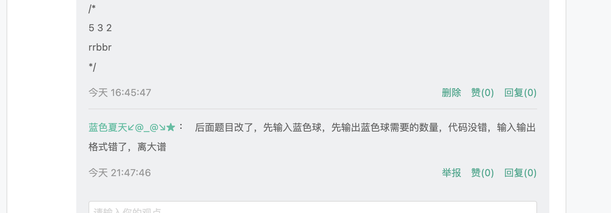

# 2022-4-2美团笔试

## 1. 双色球

桌上一列球，分为红色蓝色，小明口袋里有一些球，包含红色，蓝色；小明不喜欢两个颜色相同的球连续，所以他会把口袋里的球往桌上的球中插，问能够使没有连续的颜色相同的球存在的情况下，这一列球最少的数目是多少；如果没办法达到，问还需要多少个红色球和蓝色球？

### 示例1：

```
输入：桌上球的数目  口袋中红球数目 口袋中蓝色球数目
5 3 2
rrbbr

输出：桌上最少会有7个球
7
```

> 我吐了。。。



## 2. 尖峰数组
尖峰数组：如果可以将一个数组分成两块，前面的严格单调递增，后面的严格单调递减，最少需要往数组中增加多少个元素：

### 示例1 ：

```
输入：数组个数 数组元素
5
1 2 1 1 1

输出：最少的增加元素
3
```


## 3. 标语和思想

题干已经不记得了，貌似题目意思就是给两个字符串，一个是标语，一个是思想，然后求标语的子字符串能有多少可以表达思想（包含思想的意思），具体看输入输出吧···

### 示例1

```
输入：标语 思想
acac
ac

输出：
5
```

估计意思是 ：

```
acac满足包含ac的串有:


aca
ac (0 1)
cac
ac (2 3)
ac (0 3)
```


### 4. 3个cpu

有一批任务，有三个相同的cpu，把这批任务分给三个cpu去做，求最快需要多久完成：

### 示例：

```
输入：
n
3 4 5 6 6 7 8 

输出：
13
```

>  哇，这个输入输出都是笔者从垃圾桶里找回来的。。。这不请笔者吃老八？
